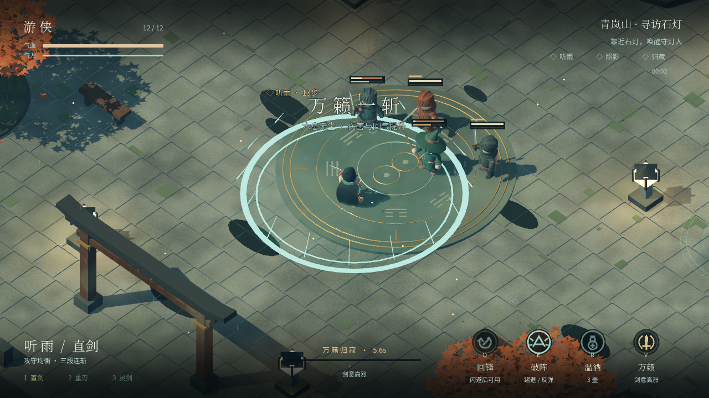
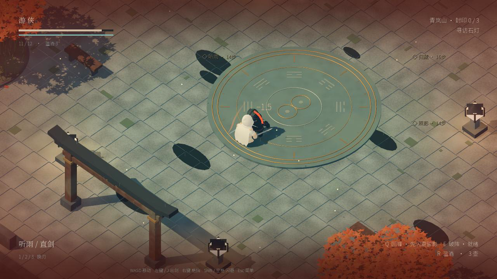

# Stillwater · 雨歇

[English](README.md) | [中文](README.zh.md) | [日本語](README.ja.md) | [Русский](README.ru.md)

**The current 3D wuxia action chapter of Moonlit Jianghu, built with Godot 4.6.2.**

A rain-washed mountain courtyard, three sealed lanterns, and a final duel with Wuxiang. Choose a blade, read the opponent’s preparation, and turn movement, deflection and collisions into openings.


[](docs/showcase/v3/combat-readability.mp4)

[Watch the combat video (MP4)](docs/showcase/v3/combat-readability.mp4). Captured in the native engine with scripted controls; the preview shows attack preparation, damage feedback and defense. It is not a performance benchmark or a human playtest.

## Sword-intent update · 2026-09-11

Successful combat builds sword intent. Press **V** at full intent to release an expanding sword cut, reflect projectiles, and gain six seconds of stronger attacks and faster stamina recovery. Six upgrades across two three-card choices support different builds: blade damage, resilience, echo recall, stamina, execution healing, and wine.

Completed seals are checkpoints for the current run. Defeat can resume from the last checkpoint with earned upgrades; quitting does not save a run. Three difficulty settings, rewarded last-moment dodges, a stronger two-phase boss, and post-execution posture recovery make defense and counterplay matter. The hero now wears ink and jade robes with a moving scarf; wet stone, maple drift, floating seal armatures, readable Chinese fonts, ability medallions, and a mastery scorecard complete the presentation. New original stingers preserve the absence of looping music.



## Current 3D version

- A real-time 3D courtyard with weathered stone, water, maple trees, rain, shadows and ambient occlusion.
- Rigged character animation and three weapons: balanced straight sword, interrupting heavy blade, and a fast spirit blade with a third-hit projectile.
- Dash leaves a temporary echo; **Q** returns through enemies along the recall path. No tether connects the echo to the player.
- **E** shoves enemies into walls or each other and reflects projectiles. Timed guards also deflect projectiles; posture breaks enable an **F** follow-up.
- Enemy preparation uses raised weapons and a brief pre-strike glint. Ordinary attacks have directional hit areas; actual boss area attacks retain area boundaries.
- Short movement braking, dash recovery, input buffering, guard reactions and local damage-direction feedback. Hit pause does not suspend movement input.
- Three seals, melee and ranged encounters, hazards, two growth choices, and a two-phase final boss. Title, guide, pause/settings and victory/defeat screens are included.
- Combat Foley replaces the continuous background-music loop.



## Run the 3D game

Install **Godot 4.6.2**, clone this repository, then run from its root:

```bash
godot --headless --editor --path . --import --quit
godot --path .
```

The default scene is `scenes/rebirth/Stillwater.tscn`. To select it explicitly:

```bash
godot --path . res://scenes/rebirth/Stillwater.tscn
```

You can also import `project.godot` in the Godot editor and press **F6** on that scene, or **F5** for the default game. Both versions have Chinese in-game UI; the README translations do not imply localized game menus.

### 3D controls

| Action | Keyboard / mouse |
| --- | --- |
| Move | WASD / arrows |
| Attack | Left mouse / J; hold for combos |
| Guard / timed deflection | Right mouse / K |
| Dash, leave echo | Shift / Space / L |
| Recall slash / shove | Q / E |
| Heal with limited wine | R |
| Activate seal / posture follow-up | F |
| Switch straight / heavy / spirit blade | 1 / 2 / 3 |
| Pause / fullscreen | Esc / F11 |

Controller mappings are implemented; physical-controller validation is still pending.

## Build, verify and contribute

See [Development & builds](docs/DEVELOPMENT.md) for export commands, architecture, tests and capture tools. The default Git branch is `master`.

- `python3 scripts/tools/run_tests.py`: **36/36** scripts passed on 2026-09-11, including movement stopping, animation motion, recall, collision damage, directional avoidance and feedback.
- Local exports: `output/releases/Stillwater-mastery-macOS.zip` and `output/releases/Stillwater-mastery-Windows.zip`. They are ignored by Git; this README does not advertise a published release download.
- macOS startup was checked on Apple M4 / Metal. Windows was cross-exported, not tested on Windows hardware. No Apple notarization has been performed.
- This is a single-map chapter. Bespoke character art, broader content, sustained human playtesting and cross-hardware validation remain open work.

[Current design and implementation](docs/STILLWATER.md) · [Documentation index](docs/README.md) · [Asset credits](docs/THIRD_PARTY_ASSETS.md)

No repository-wide reuse license has been selected. Third-party components retain their own licenses, including CC0 KayKit characters and OFL Noto fonts.

---

## Previous 2D version · Qinglan Night

The earlier 2D wuxia village remains in the repository as a separately launchable version. It uses sprite characters, day/night village scenery, melee combos, three weapon styles, five spells, inventory, growth choices and the Mountain Guardian encounter. It is not the default scene and does not contain the new 3D recall, posture or directional-feedback systems.


### Run the 2D version

After the same import step:

```bash
# Previous 2D title and journey
godot --path . res://scenes/interface/TitleScreen.tscn
# Direct entry to the 2D world
godot --path . res://scenes/main/Main.tscn
```

In the editor, open the desired scene and press **F6**. **F5** continues to launch the 3D default; there is no need to modify `project.godot`.

2D controls: WASD/arrows move, J/left mouse attack, K guard, Shift/L dash, 1–5 cast spells, Space repeat the selected spell, M inventory, Esc pause. These differ from the 3D bindings. The shared sound autoload now leaves continuous music disabled in both versions.

[2D implementation archive](docs/POLISH.md) · [2D art archive](docs/ART_V2.md) · [Original design archive](docs/archive/2d-game-plan.md)
