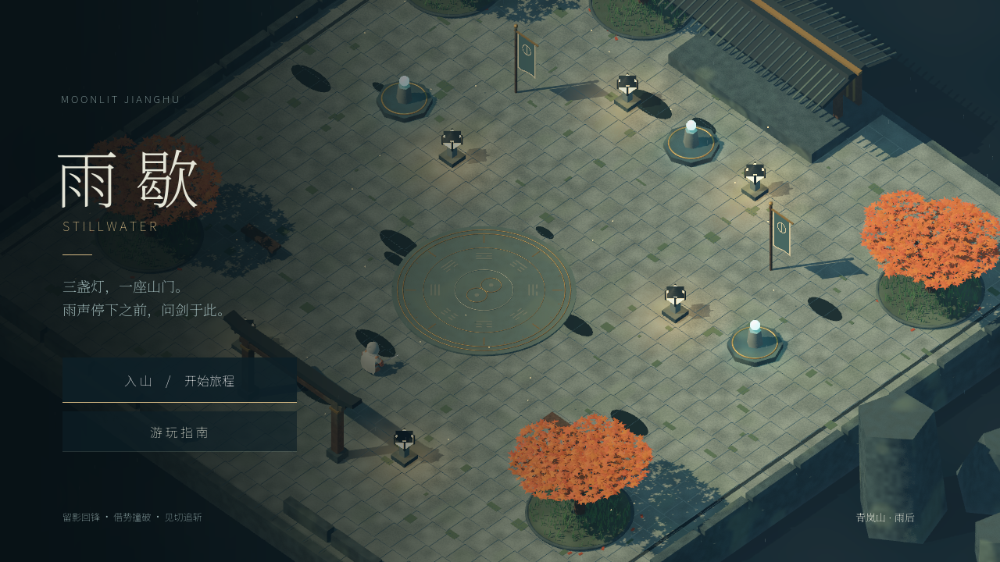
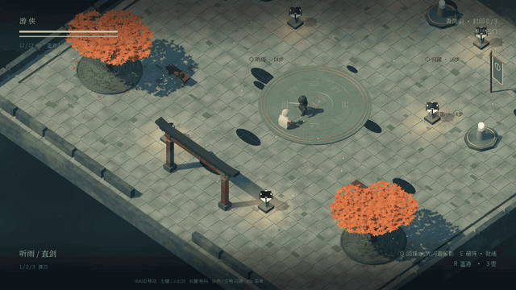
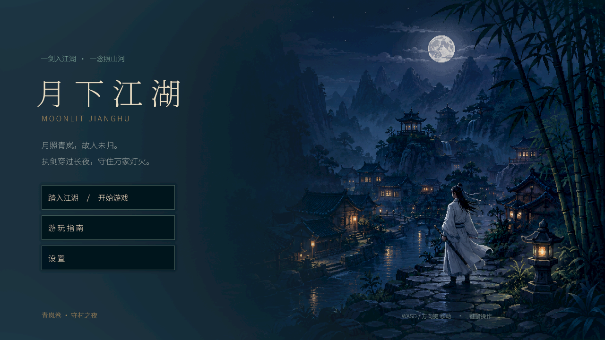
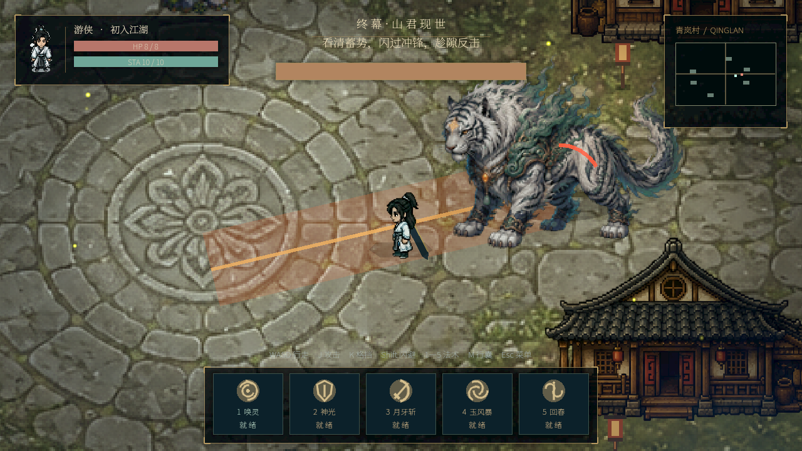

# Stillwater · 雨歇

[English](README.md) | [中文](README.zh.md) | [日本語](README.ja.md) | [Русский](README.ru.md)

**Текущая 3D-глава Moonlit Jianghu: экшен в духе уся на Godot 4.6.2.**

Двор горного храма после дождя, три печати и финальная дуэль с Усяном.



[](docs/showcase/v3/combat-readability.mp4)

[Видео боя (MP4)](docs/showcase/v3/combat-readability.mp4). Это запись движка со сценарным управлением, а не ручное прохождение или тест производительности.

## Текущая 3D-версия

- Скелетная анимация и три оружия: обычный, тяжёлый и быстрый духовный меч.
- Рывок оставляет временный образ; Q возвращает героя с ударом вдоль пути. Соединяющей нити больше нет.
- E отбрасывает врагов в стены и друг в друга, отражает снаряды. Своевременный блок тоже отражает снаряды; после нарушения стойки доступна атака на F.
- Враг поднимает оружие, выдерживает подготовку и подаёт короткий сигнал блеском клинка. От направленного удара можно уйти в сторону.
- Короткое торможение, буфер ввода, отдельная реакция на блок, указатель направления полученного урона. Постоянная музыка отключена, оставлены боевые звуки.
- Три печати, два выбора усиления, финальный босс с двумя фазами, меню, руководство, настройки и результаты.

## Запуск 3D

Из корня репозитория:

```bash
godot --headless --editor --path . --import --quit
godot --path .
# Явный выбор 3D-сцены
godot --path . res://scenes/rebirth/Stillwater.tscn
```

В редакторе откройте `project.godot` и нажмите F5. Интерфейс игры пока на китайском языке.

Управление: WASD / стрелки — движение; ЛКМ / J — атака; ПКМ / K — блок; Shift / Space / L — рывок; Q — возврат с ударом; E — отбрасывание; R — лечение; F — печать или добивающая атака; 1–3 — оружие; Esc — пауза; F11 — полный экран.

[Разработка и сборка](docs/DEVELOPMENT.md) · [Текущая реализация](docs/STILLWATER.md) · [Лицензии ресурсов](docs/THIRD_PARTY_ASSETS.md)

На 2026-09-06 пройдены 32/32 сценария регрессии. Запуск macOS проверен на Apple M4; Windows только собран, без проверки на устройстве. Проверка настоящего геймпада, длительные тесты с игроками и новые карты ещё впереди. Сейчас это глава на одной карте. Локальные сборки в `output/releases` не входят в Git.

---

## Предыдущая 2D-версия · Qinglan Night

Сохранена отдельная версия со спрайтами, деревней днём и ночью, тремя видами оружия, пятью заклинаниями, инвентарём, усилениями и боссом — Горным стражем. Новые системы возврата и стойки из 3D в ней отсутствуют.





```bash
# Титульный экран 2D
godot --path . res://scenes/interface/TitleScreen.tscn
# Сразу войти в 2D-мир
godot --path . res://scenes/main/Main.tscn
```

В редакторе откройте нужную сцену и нажмите F6. F5 по-прежнему запускает текущую 3D-версию.

Управление 2D: WASD / стрелки — движение; J / ЛКМ — атака; K — блок; Shift / L — рывок; 1–5 — заклинания; Space — повтор выбранного заклинания; M — инвентарь; Esc — пауза. Общий звуковой модуль теперь отключает постоянную музыку в обеих версиях.

[Архив реализации 2D](docs/POLISH.md) · [Архив графики 2D](docs/ART_V2.md)

Общая лицензия на повторное использование репозитория не выбрана. Для сторонних ресурсов действуют отдельные лицензии: CC0 для KayKit и OFL для Noto. Основная ветка Git — `master`.
