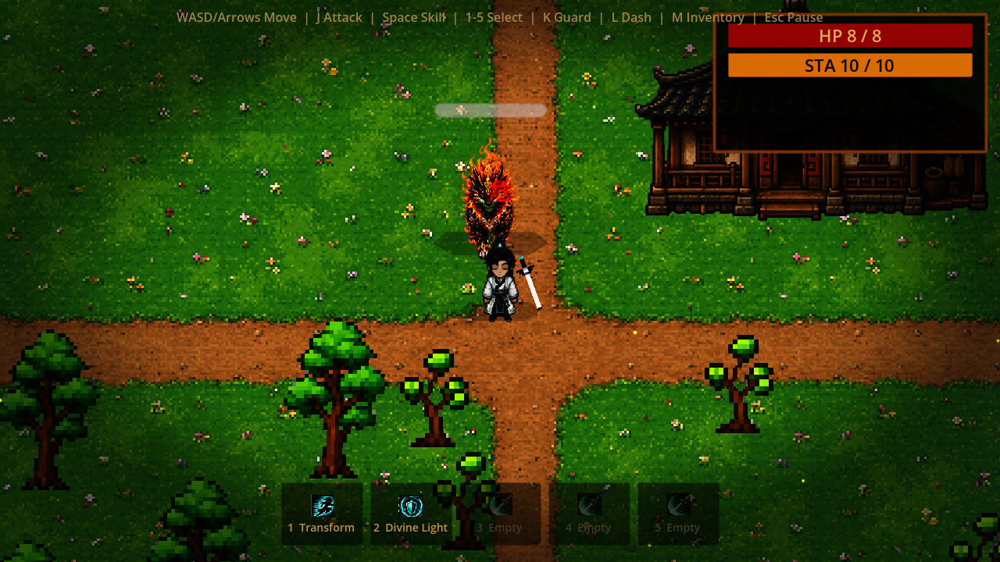
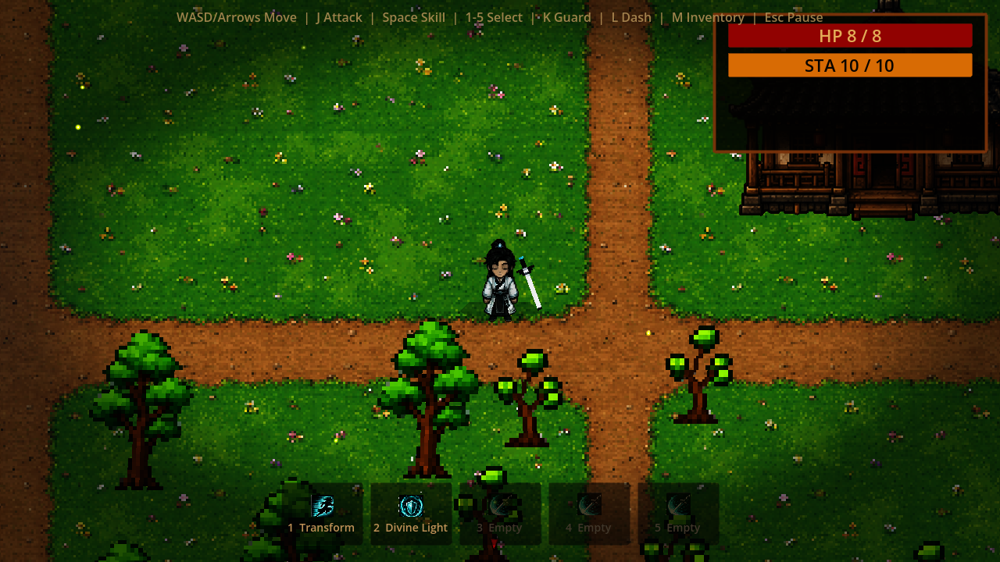
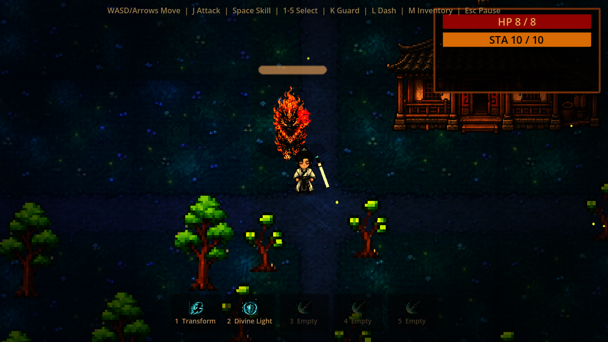

# Moonlit Jianghu

[English](README.md) | [中文](README.zh.md) | [日本語](README.ja.md) | [Русский](README.ru.md)

**一个用 Godot 4 制作的亚洲古风 / 东方幻想俯视角像素动作 RPG 原型。**

在明亮草地与冷色月光之间切换的古风村庄里游走，拔剑迎战游荡的灵体和火焰异兽，体验一个带有武侠、仙侠、江湖、修仙气质的独立游戏原型。



## 这个游戏是什么

Moonlit Jianghu 是一个未完成但可运行的游戏原型：俯视角像素动作 RPG、昼夜切换、近战战斗、敌人遭遇、背包 UI，以及一个手工布置的小型古风村庄。

它不是商业完成品，而是一份被保存下来的气氛、战斗手感和视觉实验。白天更明亮、更有草地和村庄的质感；夜晚则更冷、更神秘，有月色、灯光和漂浮的粒子。

## 亮点

- **昼夜切换**：按 `P` 在白天和夜晚之间切换。
- **亚洲古风 / 东方幻想场景**：草地、土路、屋檐、树木、岩石、可破坏物和魔法粒子。
- **武侠 / 仙侠气质**：持剑角色、灵异敌人、江湖感和修仙幻想氛围。
- **俯视角动作战斗**：移动、冲刺、攻击、防御、体力、击退和命中特效。
- **敌人遭遇**：骷髅、僵尸、快速敌人和火狮变体。
- **像素素材工作流**：包含用于清理 AI 辅助生成 sprite sheet 的工具脚本。

## 截图

| 白天村庄 | 白天战斗 |
| --- | --- |
|  |  |

| 夜晚村庄 | 夜晚战斗 |
| --- | --- |
|  |  |

## 操作

- 移动：`WASD` 或方向键
- 攻击：`J` 或鼠标左键
- 防御：`K`
- 冲刺：`L`
- 使用当前技能：`Space`
- 选择技能：`1`-`5`
- 背包：`M`
- 切换白天/夜晚：`P`
- 重置场景：`R`

## 本地运行

需要 Godot `4.6.2`。

```bash
godot --path .
```

## 搜索关键词

`Godot 游戏` `Godot 4` `像素游戏` `像素风` `俯视角` `动作 RPG` `独立游戏` `游戏原型` `亚洲古风` `东方幻想` `古风游戏` `武侠` `仙侠` `江湖` `修仙` `中国风` `古风村庄` `昼夜切换` `近战战斗`
