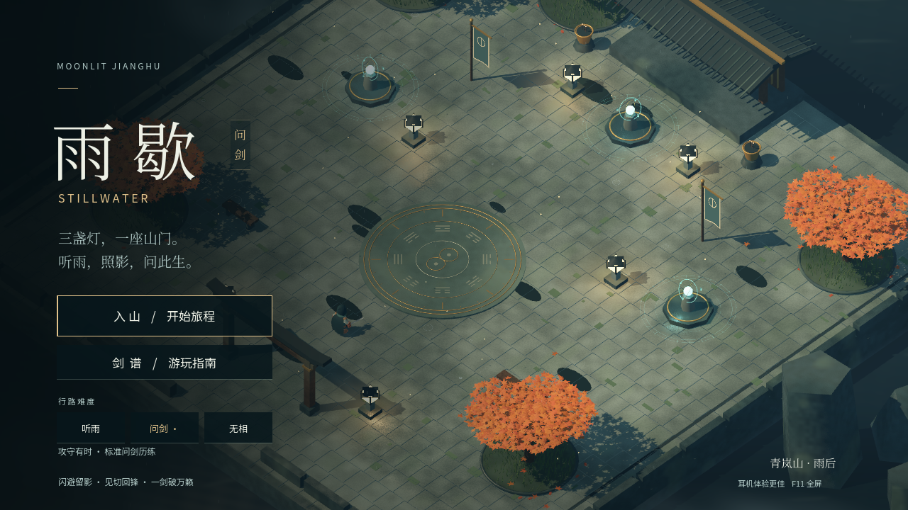

# 雨歇 · Stillwater

[English](README.md) | [中文](README.zh.md) | [日本語](README.ja.md) | [Русский](README.ru.md)

**Moonlit Jianghu 的 3D 武侠动作篇章 · 剑意更新，使用 Godot 4.6.2。**

雨后的青岚山门，三盏石灯仍未熄灭。选择兵刃，读懂敌人的蓄势，借闪避、见切与碰撞制造机会，解开封印后向无相问剑。



[](docs/showcase/v3/combat-readability.mp4)

[观看完整战斗视频（MP4）](docs/showcase/v3/combat-readability.mp4)。视频使用原生引擎渲染、脚本操控，展示读招、受击与防守；不是真人试玩录像或性能基准。

## 剑意更新 · 2026-09-11

进攻、见切、极限闪避、命中回锋与追斩积累剑意；积满后按 **V 万籁一斩**，剑环沿途斩敌、反弹飞弹，随后获得 6 秒伤害与回气提升。每次对决都有积累与爆发。

- 六种成长分布于两次三选一：强化兵刃、提高气血、精进回锋、加快回气、追斩回血、补充温酒。
- 已解封印成为本局检查点；失败后保留成长、恢复气血再战，不必重复整段旅程。退出游戏后不保留本局检查点。
- 听雨 / 问剑 / 无相三档难度；极限闪避奖励反击，首领出招具备抗打断，追斩后架势归零，避免无限处决。
- 墨青剑客与动态披巾、湿石与雨圈、飘枫、悬浮灯阵；技能图标、剑意条、剑评结算和可读中文字体全面更新。
- 原创短音效用于石灯、首领、绝技与胜利；保留无持续循环配乐的设计。


## 当前 3D 版本

- 实时 3D 石院、水面、枫树、旗幡、雨、风化材质、阴影与环境遮蔽。
- 骨骼角色与三种兵刃：均衡直剑、可打断的重刃、快速且第三击释放剑气的灵剑。
- 闪避留下短暂残影；**Q 回锋**沿归路穿斩。残影与角色之间不再有牵线。
- **E 破阵**把敌人踢向墙体或其他敌人，并反弹飞弹；见切也能反射飞弹。打满架势后靠近按 **F 追斩**。
- 敌人举刃蓄势、出手前短促刃光提示；普通攻击有方向判定，实际范围招式保留边界预警。
- 短距离收步、闪避收势、攻击输入缓冲、独立挡击与受击方向反馈；命中停顿期间仍处理移动输入。
- 三处封印、远近程遭遇、地面危险、两次成长，以及有第二阶段的首领。包含标题、指南、暂停设置和胜败结算。
- 停用持续循环配乐，以战斗音效提供反馈。


## 启动 3D 版本

安装 **Godot 4.6.2**，克隆仓库，在项目根目录执行：

```bash
godot --headless --editor --path . --import --quit
godot --path .
```

默认入口为 `scenes/rebirth/Stillwater.tscn`，也可明确指定：

```bash
godot --path . res://scenes/rebirth/Stillwater.tscn
```

编辑器中导入 `project.godot`，按 **F5** 启动默认游戏；或打开该场景按 **F6**。游戏内界面目前为中文，其他语言 README 不代表游戏已完成相应本地化。

### 3D 操作

| 操作 | 键鼠 |
| --- | --- |
| 移动 | WASD / 方向键 |
| 出剑 | 左键 / J，按住连续攻击 |
| 格挡 / 见切 | 右键 / K |
| 闪避并留影 | Shift / 空格 / L |
| 回锋 / 破阵 | Q / E |
| 使用限量温酒治疗 | R |
| 万籁一斩（满剑意） | V |
| 点亮石灯 / 破势追斩 | F |
| 切换直剑 / 重刃 / 灵剑 | 1 / 2 / 3 |
| 暂停 / 全屏 | Esc / F11 |

已实现手柄映射，尚未完成实体手柄验证。

## 构建、验证与文档

[开发与构建说明](docs/DEVELOPMENT.md) 包含导出命令、架构、测试和录像工具。Git 默认分支为 `master`。

- `python3 scripts/tools/run_tests.py`：2026-09-11 验证 **36/36** 通过，包含动作实际运动、松手制动、回锋、撞墙、侧移避击和伤害反馈。
- 本地导出包为 `output/releases/Stillwater-mastery-macOS.zip`、`output/releases/Stillwater-mastery-Windows.zip`。构建产物不纳入 Git，当前没有在此提供公开发行包下载。
- macOS 已在 Apple M4 / Metal 下验证启动；Windows 仅交叉导出，未完成 Windows 实机验证；尚未进行 Apple 公证。
- 当前内容为单地图篇章，专属角色美术、更多内容、长期真人试玩与跨硬件验证仍待完善。

[当前设计与实现](docs/STILLWATER.md) · [文档索引](docs/README.md) · [素材与许可](docs/THIRD_PARTY_ASSETS.md)

仓库尚未指定整体复用许可。第三方素材遵循各自许可，包括 CC0 的 KayKit 角色与 OFL 的 Noto 字体。

---

## 旧版 2D · 青岚一夜

原先的二维武侠村庄保留在仓库中，可以独立启动。它使用角色精灵图，包含昼夜村庄、三段连击、三种兵刃、五种法术、行囊、成长与山君首领战。它不是默认入口，也不包含当前 3D 的回锋、架势与方向反馈系统。


### 启动 2D 版本

完成上面的资源导入后执行：

```bash
# 旧版二维标题与旅程
godot --path . res://scenes/interface/TitleScreen.tscn
# 直接进入二维世界
godot --path . res://scenes/main/Main.tscn
```

编辑器中打开对应场景按 **F6**。**F5** 仍启动默认 3D 版本，无需修改 `project.godot`。

2D 操作：WASD / 方向键移动，J / 左键出剑，K 格挡，Shift / L 闪避，1–5 施放法术，空格重复当前法术，M 行囊，Esc 暂停。注意这套技能键位与 3D 不同。共用的声音自动加载脚本现已停用持续配乐，因此两种入口均不自动播放旧循环音乐。

[二维实现归档](docs/POLISH.md) · [二维美术归档](docs/ART_V2.md) · [最初设计归档](docs/archive/2d-game-plan.md)
