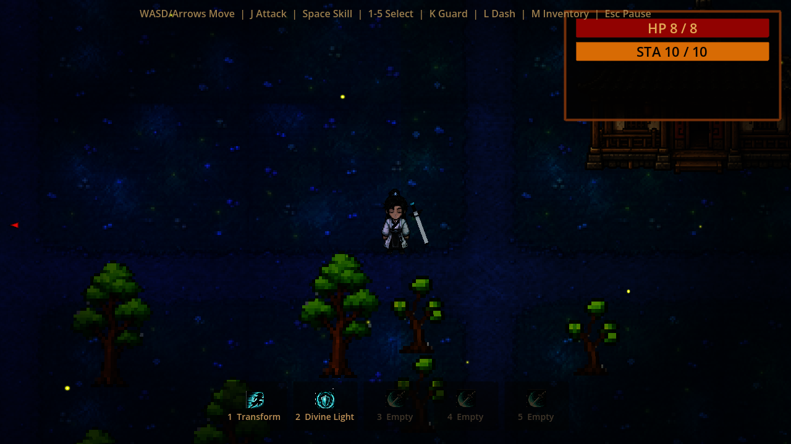
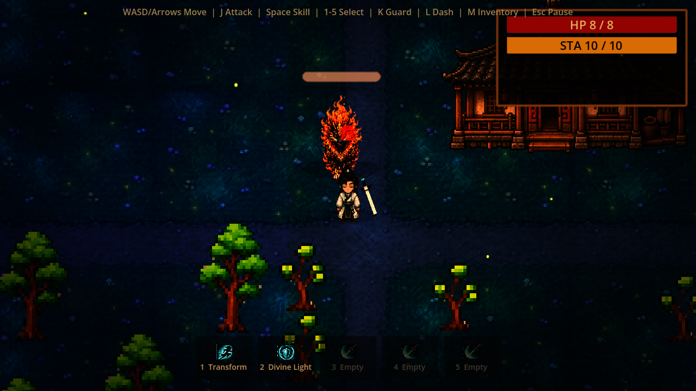
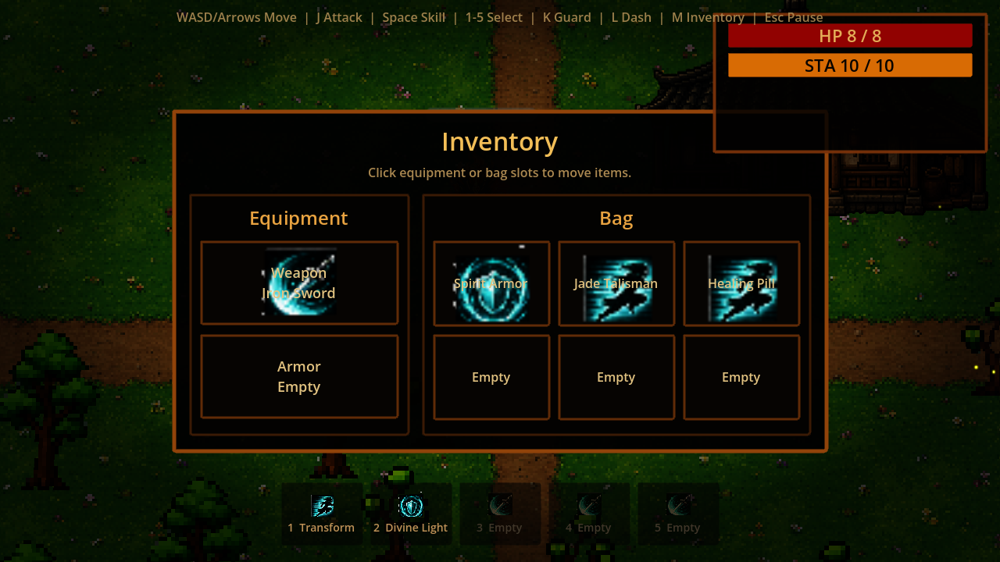
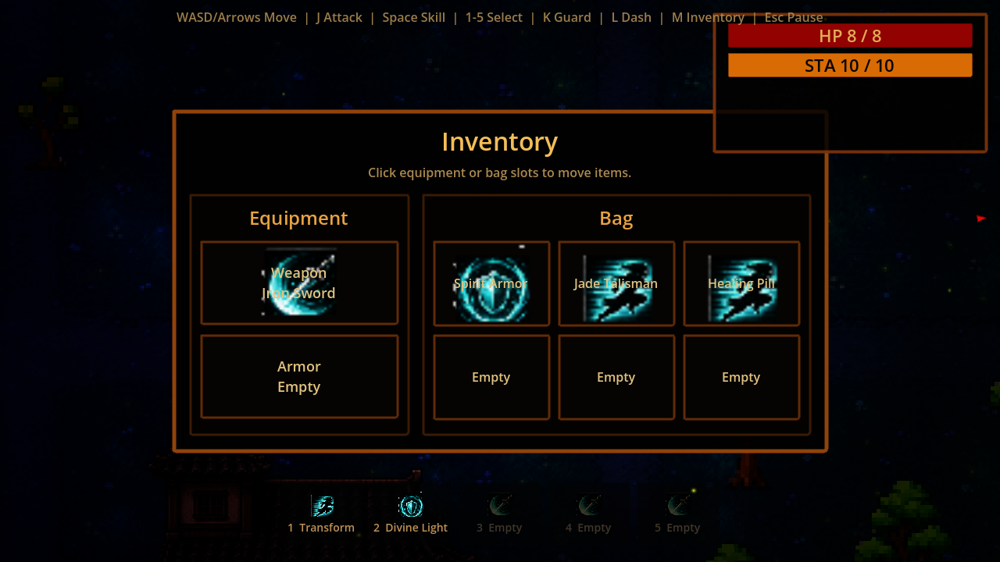

# Moonlit Jianghu

An unfinished Godot 4 top-down action RPG prototype with a retro xianxia mood.

This project is not a finished game. It is a playable snapshot of an experiment: movement, melee combat, enemy behavior, a small village map, night ambience, simple inventory UI, and a collection of AI-assisted pixel-art asset experiments.



## Download Builds

Release exports can be generated into `out/`:

- `out/moonlit-jianghu-macos.zip`
- `out/moonlit-jianghu-windows.exe`

Build artifacts are intentionally ignored by git. Attach them to a GitHub Release or upload them to a game page instead of committing them directly.

The macOS build is unsigned, so macOS may ask players to right-click and choose Open. The Windows executable is also unsigned, so Windows Defender may show a warning.

## What Is In This Prototype

- Top-down player movement with dash, melee attacks, blocking, stamina, and combat feedback.
- Enemy encounters including skeleton-style enemies, fast enemies, zombies, and a fire-lion variant.
- A small curated village map with houses, trees, breakable objects, landmarks, and boundary walls.
- Night ambience with darker ground art, lights, firefly-like particles, and mood effects.
- A lightweight inventory overlay with equipment and bag slots.



## Controls

- Move: `WASD` or arrow keys
- Attack: `J` or left mouse button
- Defend: `K`
- Dash: `L`
- Use selected skill: `Space`
- Select skills: `1`-`5`
- Inventory: `M`
- Toggle night ambience: `P`
- Reset scene: `R`



## Project Status

This is a stopping point, not a production release. Some tests still describe older scene expectations, some visual systems are experimental, and the asset folder contains both active and unused exploratory files.

The most honest way to view it is as a preserved prototype: a record of the game direction, the visual experiments, and the combat feel that made it far enough to be shared.



## Building Locally

This project uses Godot `4.6.2`.

```bash
godot --path .
```

Export macOS:

```bash
mkdir -p out
godot --headless --path . --export-release "macOS" out/moonlit-jianghu-macos.zip
```

Export Windows:

```bash
mkdir -p out
godot --headless --path . --export-release "Windows Desktop" out/moonlit-jianghu-windows.exe
```
